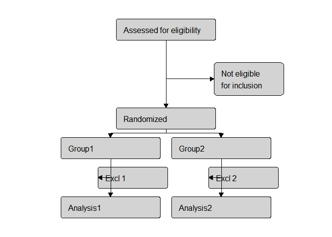
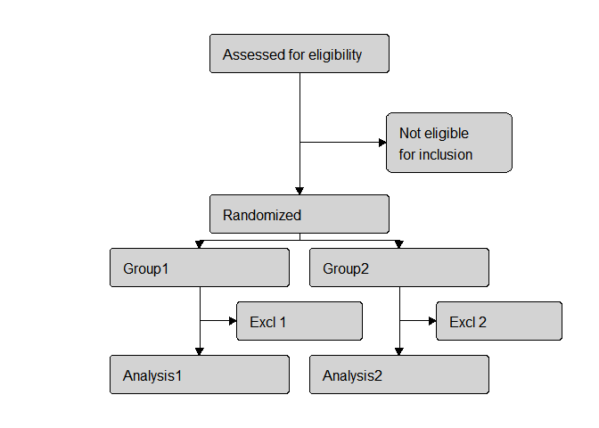
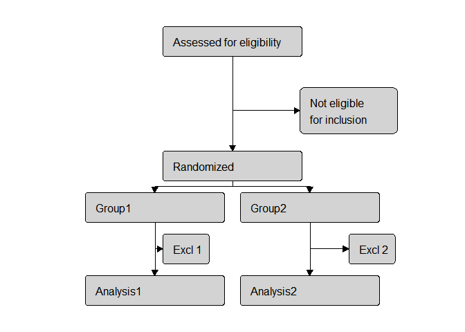

<!-- README.md is generated from README.Rmd. Please edit that file -->

# flowchart


## Goal

The goal of this R package is to make it easier to layout a flowchart.
The Gmisc package goes part of the way by allowing one to create boxes
with text in and link them together, but you still have define the
locations of boxes yourself. This is where flowchart helps. It
automatically places the boxes in the figure space by making suitable
guesses based on the data supplied it.

## Installation/Loading

This package is currently only available on github. 

``` r
# install.packages("devtools")
# less developmental version
token <- readLines("PATH_TO_TOKEN")
devtools::install_github("CTU-bern/flowchart")
# main developmental version
devtools::install_github("aghaynes/flowchart")
```

The package is loaded into R as usual

``` r
library(flowchart)
```

    ## Loading required package: dplyr

    ## 
    ## Attaching package: 'dplyr'

    ## The following objects are masked from 'package:stats':
    ## 
    ##     filter, lag

    ## The following objects are masked from 'package:base':
    ## 
    ##     intersect, setdiff, setequal, union

    ## Loading required package: Gmisc

    ## Loading required package: Rcpp

    ## Loading required package: htmlTable

    ## Loading required package: grid

## Usage

`flowchart` makes it’s guesses based on data provided in the form of a
dataframe. Each row in the dataframe represents a box in the flowchart.
`flowchart` expects, as a minimum, columns named `level`, `group`,
`text` and `incexc`. These four variables represent the verticle
position (from the top), the horizontal position (from the left, or `NA`
for central), the text that should be in the box, and whether the row is
for inclusion (`"inc"`) or exclusion (`"exc"`).

``` r
dat <- data.frame(level = c(1, 2, 3, 4, 4, 5, 5, 6, 6),
                  group = c(NA, NA, NA, 1, 2, 1, 2, 1, 2),
                  text  = c("Assessed for eligibility", "Not eligible\nfor inclusion", 
                            "Randomized", "Group1", "Group2", "Excl 1", "Excl 2", "Analysis1", 
                            "Analysis2"),
                  incexc = c("inc", "exc", "inc", "inc", "inc", "exc", "exc", 
                             "inc", "inc"))
dat
```

    ##   level group                        text incexc
    ## 1     1    NA    Assessed for eligibility    inc
    ## 2     2    NA Not eligible\nfor inclusion    exc
    ## 3     3    NA                  Randomized    inc
    ## 4     4     1                      Group1    inc
    ## 5     4     2                      Group2    inc
    ## 6     5     1                      Excl 1    exc
    ## 7     5     2                      Excl 2    exc
    ## 8     6     1                   Analysis1    inc
    ## 9     6     2                   Analysis2    inc

``` r
flowchart(dat)
```

    ## Warning: package 'bindrcpp' was built under R version 3.4.3

<!-- -->

In the above example, the exclusion boxes are a little too far to the
left. This is easily rectified.

``` r
flowchart(dat, group_exc_shift = 0.5)
```

<!-- -->

Note that one box has two lines of text. This is accomplished with the
newline operator (`\n`).

### Changing locations of boxes

`flowchart` provides the option to return a dataframe of values that can
be easily modified to adjust the position of boxes (note that the figure
has been suppressed in this document, it is always produced by
`flowchart`).

``` r
tab <- flowchart(dat, tab = TRUE)
```

``` r
tab
```

    ##   level group                        text incexc         x         y width
    ## 1     1     0    Assessed for eligibility    inc 0.5000000 0.8750000  0.30
    ## 2     2     0 Not eligible\nfor inclusion    exc 0.7500000 0.6666667  0.21
    ## 3     3     0                  Randomized    inc 0.5000000 0.5000000  0.30
    ## 4     4     1                      Group1    inc 0.3333333 0.3750000  0.30
    ## 5     4     2                      Group2    inc 0.6666667 0.3750000  0.30
    ## 6     5     1                      Excl 1    exc 0.4000000 0.2500000  0.21
    ## 7     5     2                      Excl 2    exc 0.7333333 0.2500000  0.21
    ## 8     6     1                   Analysis1    inc 0.3333333 0.1250000  0.30
    ## 9     6     2                   Analysis2    inc 0.6666667 0.1250000  0.30

The `x` and `y` columns are in proportions of the device space and
represent the middle of the box. The `width` column is the width of the
boxes, again in proportions. Thus, to decrease the widths of the “Excl”
boxes and move the right one further to the right, we can edit those
values in `tab` and use tab in `flowchart`:

``` r
tab$x[7] <- 0.8
tab$width[6:7] <- 0.1
flowchart(tab)
```

<!-- -->

### Special fonts and characters

`flowchart` can also use expressions to create bold or italic fonts, or
to include Greek letters.

``` r
tab$text[4] <- "expression(paste(bold('Group'), '1'))"
tab$text[5] <- "expression(paste(italic('Group'), '2'))"
flowchart(tab, group_exc_shift = 0.5)
```

<!-- -->
